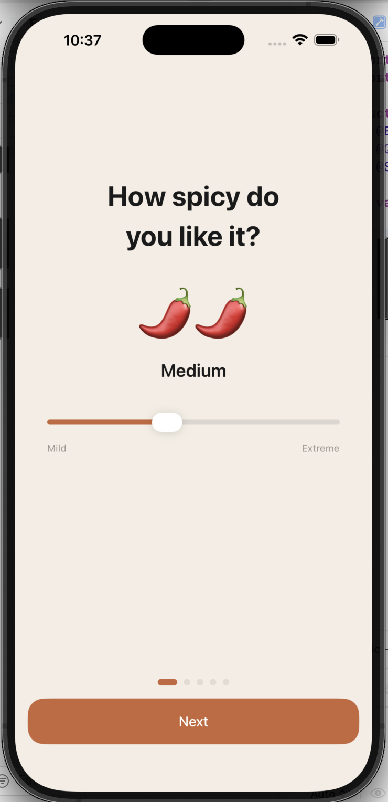
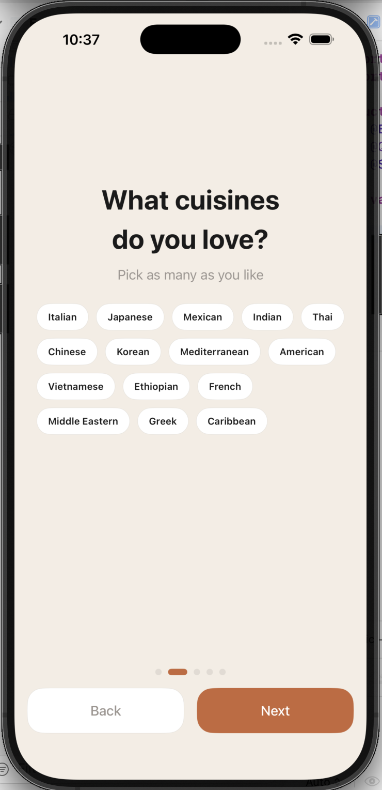
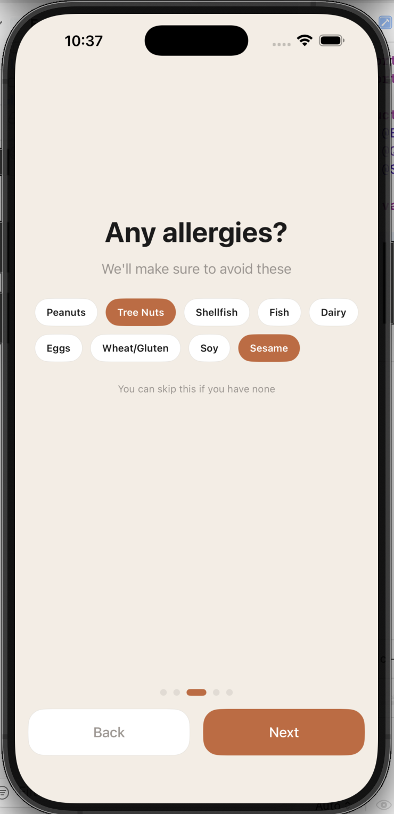
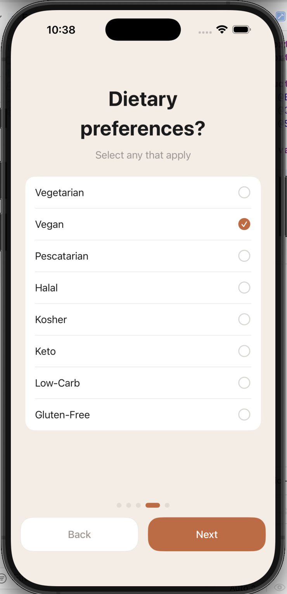
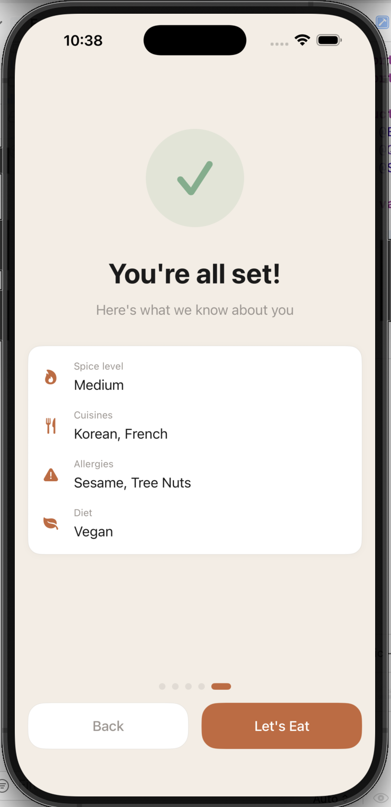
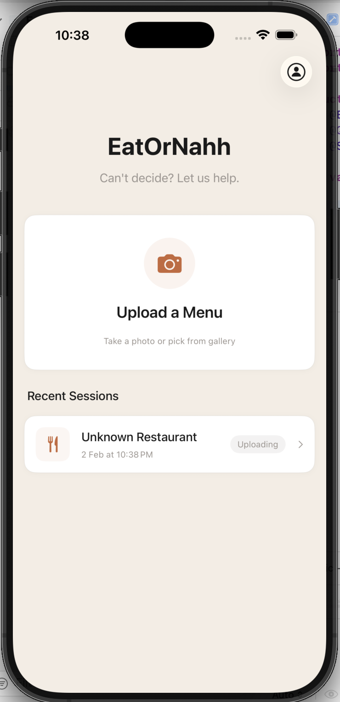
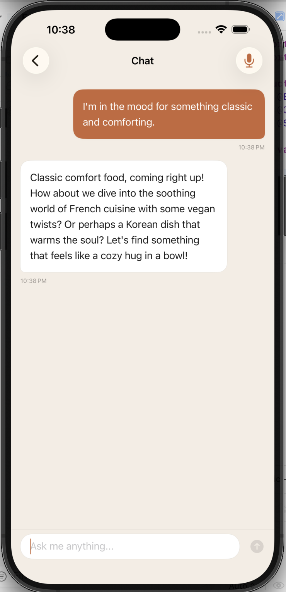

# EatOrNahh

An iOS app that helps indecisive diners choose what to eat. Upload a menu photo, and AI analyzes it to recommend dishes through a conversational interface with text and voice support.

## Screenshots

<p align="center">
  
  
  
  
</p>

<p align="center">
  
  
  
</p>

## Features

- **Personalized Onboarding** — Set spice tolerance, favorite cuisines, allergies, and dietary preferences
- **Menu OCR** — Upload menu photos and GPT-4o Vision extracts all dishes automatically
- **AI Chat** — Conversational recommendations based on your preferences and mood
- **Voice Mode** — Speech-to-text input and text-to-speech responses
- **Dish Cards** — AI-generated food images with details, tags, and save functionality
- **Profile Management** — Edit preferences, view saved dishes, browse past sessions

## Tech Stack

- **SwiftUI** + **SwiftData** (iOS 18+, iPhone only)
- **OpenAI GPT-4o** for chat, vision (menu OCR), and image generation
- **Protocol-based services** — image generation provider is swappable (DALL-E 3, Flux, SDXL)
- **Speech framework** — SFSpeechRecognizer + AVSpeechSynthesizer
- **CoreLocation** for restaurant detection
- No third-party dependencies — pure URLSession networking

## Architecture

```
EatOrNahh/
├── Config/          # API keys, constants, service factory
├── Models/          # SwiftData @Model classes + Codable DTOs
├── Services/        # OpenAI, image gen, menu parsing, location, speech
│   └── Protocols/   # Service protocols for testability
├── Theme/           # Design tokens, view modifiers
├── Utilities/       # AppState, haptics, image compression
├── ViewModels/      # @Observable view models (MVVM)
└── Views/
    ├── Components/  # Reusable UI (chips, flow layout, cached images)
    ├── Conversation/# Chat UI, message bubbles, dish carousel
    ├── DishCard/    # Compact + expanded dish cards
    ├── Home/        # Main screen, session rows
    ├── MenuUpload/  # Photo picker, processing overlay
    ├── Onboarding/  # 5-page preference flow
    ├── Profile/     # Settings, saved dishes, logout
    └── VoiceMode/   # Waveform, live transcript, mic UI
```

## Setup

1. Clone the repo
2. Open `EatOrNahh.xcodeproj` in Xcode
3. Set your OpenAI API key:
   - **Product > Scheme > Edit Scheme** (or `Cmd + <`)
   - Select **Run > Arguments**
   - Add environment variable: `OPENAI_API_KEY` = `your-key`
4. Select an iPhone simulator and run (`Cmd + R`)

## License

MIT
